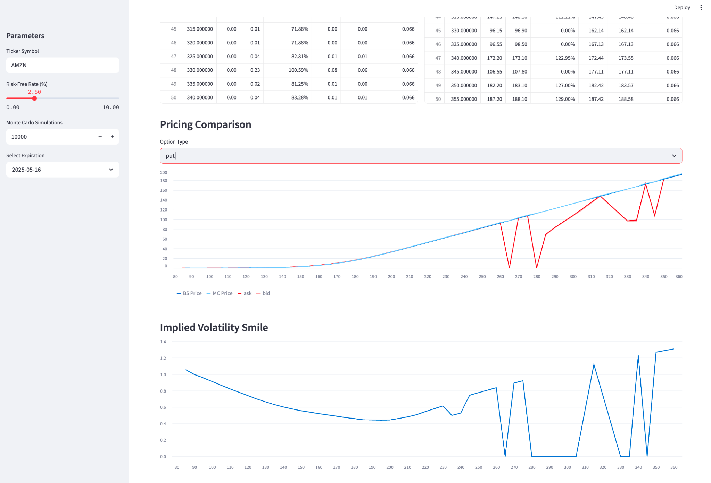

# Options-Pricing-Model

Project purpose and motivation

Theory behind Black Scholes (BS) and Monte Carlo (MC) models

Technologies used (Streamlit, yfinance, NumPy)

How to run it: streamlit run dashboard.py
